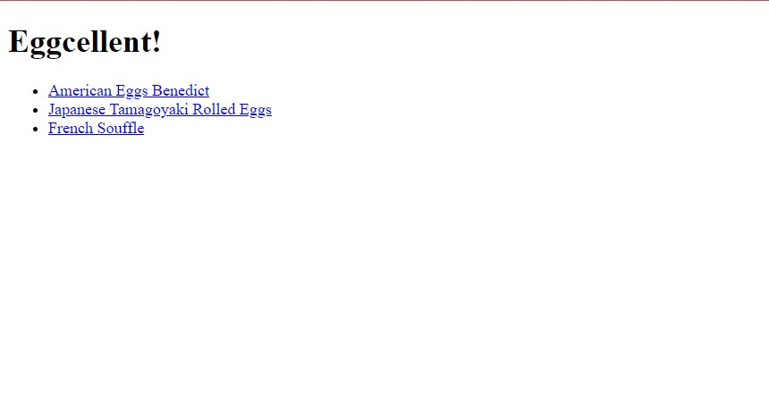

# EggcellentRecipes
Simple recipe website documenting egg recipes with a collection of cracking jokes. 
You can find a live demo [_here_](https://stakhey.github.io/EggcellentRecipes/). 
## Table Of Contents
- [General Information](#general-information)
- [Technologies Used](#technologies-used)
- [Screenshots](#screenshots)
- [Room For Improvement](#room-for-improvement) 
- [Credits](#acredits) 
- [Contacct](#contact) 
- [License](#license)  
## General Information
This was my second project with HTML and CSS, but as I hadn't practiced web development in roughly 6 months, I wanted to get warmed up and tackle a similar project but with some major improvements. This is why with my rusty skills I decided to remaster my original recipe website called [ThymeIsMoney](https://stakhey.github.io/ThymeIsMoney/), but with a more common ingredient, and one of my favourite foods, eggs. The project helped me refresh lots of different HTML tags, such as lists, and CSS declarations for various tasks such as customising links and setting up a nice colour scheme. The main challenge of the project was to just get refamiliarised with the syntax after a long break, but technically I struggled to make my ingredients list look right, which I solved by setting the list style as none. One major improvement on the original project was introducing a "Back To Top" button, which was quite fun to do as I got to learn a bit more about linking within a web page. I also messed about with emojis a little bit, and ended up settling on a timer to show how long the cooking process would take. The iitial time spent on the project was roughly 7-8 hours, but after that I added more recipes as a way to solidify knowledge gained during the original process and to form a habit, so I don't ever have to revert back to zero again.
## Technologies Used 
- HTML5 
- CSS3
## Screenshots 
Here is a look at the original homepage:  
  
Here is a look at one of the original recipe pages:  
  
Here is a look at the current homepage:  
   
Here is a look at one of the current recipe pages:   
 
## Room For Improvement 
If I were to revisit the project in the future, I would: 
- Add 2-3 more recipe pages
- Improve the headers or find a more suitable font
- Create a categorisation system 
- Remove the awkward gap between the headers and back to home page button
## Credits
- The design brief came from [TheOdinProject](https://www.theodinproject.com/). 
- The original creators of the recipes are credited at the top of each page and in a comment in the HTML.
## Contact
Created by @Stakhey - feel free to contact me! 
## License 
This project is open source and available under the [MIT License](https://choosealicense.com/licenses/mit/)